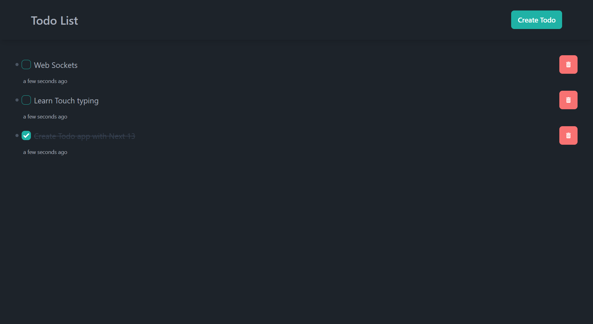

# Todo App using Next JS 13



## Technologies used

-   Next 13
-   Day JS
-   Tailwind CSS
-   Daisy UI
-   Typescript
-   prisma
-   SQLite

## Getting Started

First, run the development server:

```bash
npm run dev
# or
yarn dev
# or
pnpm dev
```

## License

[MIT LICENSED](./LICENSE)
